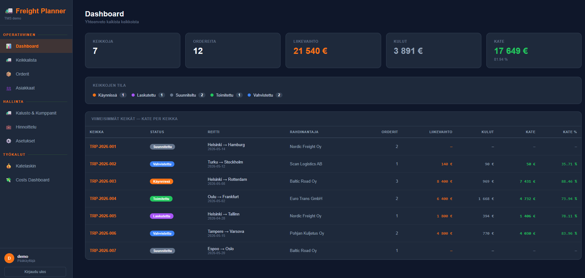
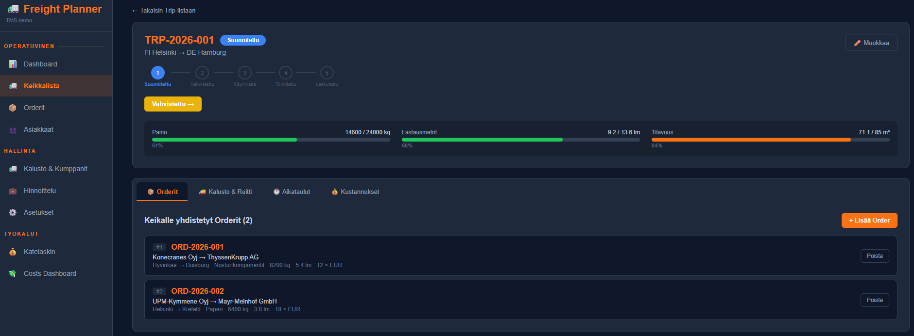
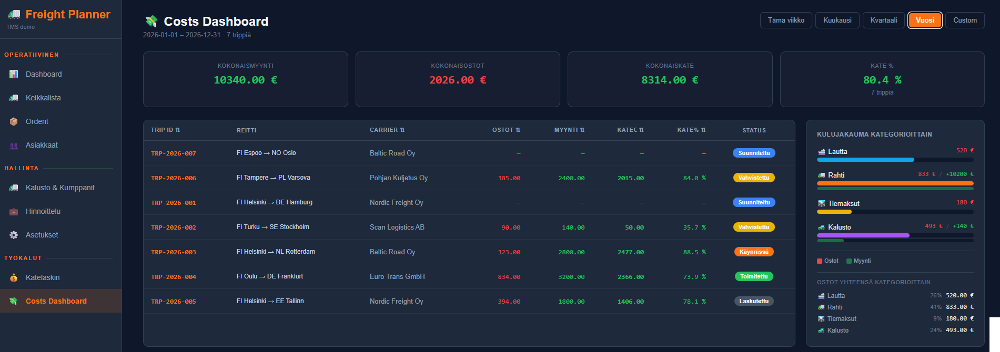
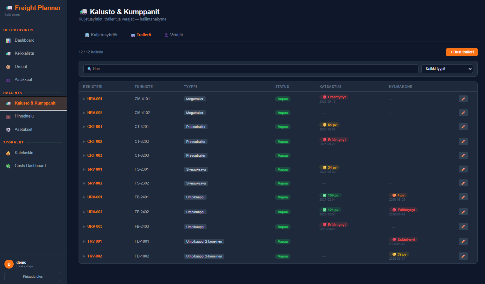
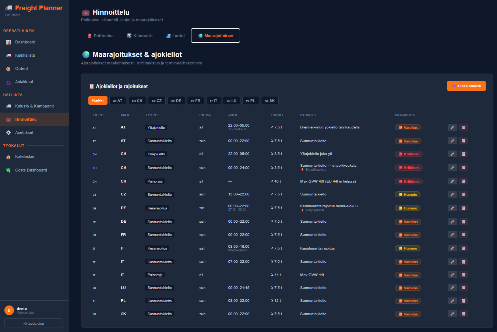
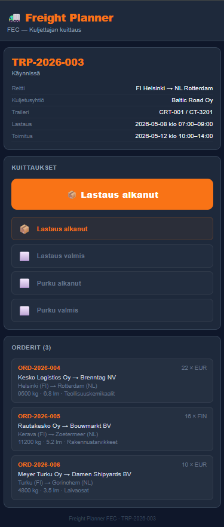
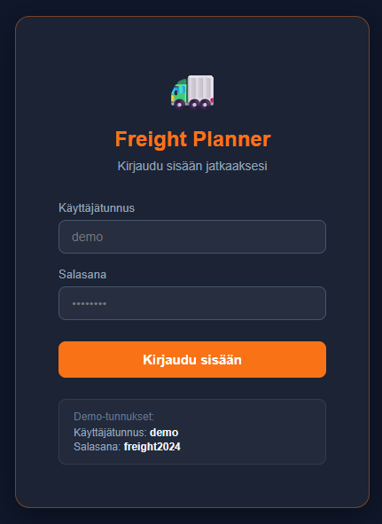

# 🚛 Freight Planner

A full-stack Transport Management System (TMS) built as a portfolio project, demonstrating real-world logistics operations management. Inspired by real-world international freight forwarding workflows between Finland and Continental Europe.

Designed to demonstrate how operational logistics expertise can be transformed into modern Transport Management System (TMS) software.

---

## 🏗️ Architecture

```
React 18 Frontend
       │
   REST API
       │
Python Flask
       │
    SQLite
```

---

## 🌐 Live Demo

> **Username:** `demo` **Password:** `freight2024`

---

## ⚡ Key Features

- 🚛 **Trip Management** — full lifecycle from planning to invoicing
- 📦 **Order Management** — capacity validation, trailer compatibility checks
- 💰 **Cost Management** — 20+ cost codes, auto fuel surcharge, margin tracking
- 🚐 **Fleet & Trailer Management** — inspection tracking, refrigeration service alerts
- 👥 **Customer Management** — consignor/consignee registry with autocomplete
- 🌍 **Country Restriction Engine** — driving ban rules across 9 countries
- 📱 **Driver Mobile Workflow** — FEC check-in without login, OTD tracking
- 📊 **KPI Dashboard** — real-time margins, OTD%, capacity utilization

---

## 📸 Screenshots

| Dashboard | Trip Detail | Cost Management |
|---|---|---|
|  |  |  |

| Hallinta — Kalusto | Maarajoitukset | FEC-kuittaus | Login |
|---|---|---|---|
|  |  |  |  |

---

## ✨ Features

### 📊 Dashboard
- 5 KPI cards: active trips, open orders, monthly revenue, margin %, OTD%
- Status distribution overview
- Trip table with margin % per trip
- Alert system: overloaded trips, missing cost lines, schedule risks

### 🚛 Trip Management
- Full lifecycle: **Suunniteltu → Vahvistettu → Käynnissä → Toimitettu → Laskutettu**
- Visual status chain with forward/backward navigation
- Real-time capacity bars — color-coded at 70% / 90% / 100% thresholds
- Ferry route selection (4 routes: Finland → Germany / Belgium)
- Automatic trailer rental cost on confirmation
- Invoice lock — fully locked when invoiced

### 📦 Order Management
- Orders created independently, assigned to trips
- Automatic capacity validation (weight, loading meters, volume)
- Trailer compatibility checks:
  - Long cargo (>2.5m) blocked from box trailers
  - Tail lift orders routed via terminal unloading workflow
- Auto-generated references (HEL-2026-001 format)
- Order copying for repeat shipments
- Consignor/consignee autocomplete from customer registry

### 💰 Cost Management
- 20+ cost codes in logical groups (Freight / Fuel / Tolls / Equipment / Ferry / Extras)
- Revenue vs. cost tracking per trip — real-time margin calculation
- Category grouping: 🚢 Ferry · 🚛 Freight · 🛣️ Tolls · 🚜 Equipment · ➕ Extras
- Automatic fuel surcharge when FREIGHT (120) cost added
- Ferry cost split evenly across orders with per-order breakdown
- Inline editing with pencil icon per cost line
- Invoice confirmation modal with lock mechanism

### 💸 Costs Dashboard
- Portfolio-level KPIs: total revenue, costs, margin € and %
- Date range filter: week / month / quarter / year / custom
- Sortable trip table with 8 columns
- Visual cost breakdown by category (CSS-based bar chart)

### 📱 FEC Driver Check-in (Mobile)
- Public URL for drivers: `/driver/:trip_id` — no login required
- 4 check-in buttons: Loading started / completed · Unloading started / completed
- Auto: waiting cost (800) added if loading starts >30 min late
- Auto: OTD timestamp set on delivery completion

### 🌍 Country Restrictions & Driving Bans
- 15 rules across 9 countries (CH, DE, AT, FR, IT, PL, CZ, SK, LU)
- Rule types: Sunday ban · Night ban · Summer ban · Weight limit
- Smart restriction engine: day iteration, seasonal ranges, time window overlap
- Route checker with automatic intermediate country detection
  - FI → CH = [DE + CH], FI → IT = [DE + AT + IT], FI → FR = [DE + FR]
- Color-coded results per country: 🔴 Blocked · 🟠 Warning · 🟡 Notice
- 16 terminals across 8 countries for tail lift unloading planning

### 🚐 Hallinta — Kalusto & Kumppanit
- **Carriers:** 6 companies, trucks inline, status changes directly in list
- **Trailers:** 12 trailers (TIP Trailer Services), type filter, leasing/rental rates
  - Inspection tracking: next due date with alert badges 🔴/🟠/🟡/✅
  - Refrigeration service tracking (thermo trailers only)
  - Maintenance history log per trailer
- **Drivers:** all drivers across all carriers, status dropdown inline

### 💼 Hallinta — Hinnoittelu
- **Fuel rates:** monthly multipliers, active/expired/upcoming status
- **Km rates:** domestic 1.85 €/km · continental 2.20 €/km, validity periods
- **Ferry rates:** 4 routes in database (replaces hardcoded values)
- **Country restrictions:** full management UI (add/edit/delete rules)

### ⚙️ Hallinta — Asetukset
- Company info (used in Transport Order, CMR documents)
- Live document preview — shows exactly how data appears in documents
- Notification thresholds: inspection alerts, capacity warnings, delay alerts
- Animated toggles per alert type

### 💰 Cost Calculator
- Standalone quotation and margin calculator
- Domestic + continental km-based pricing
- Fuel surcharge, toll options, ferry pricing
- Real-time margin % ↔ selling price calculation

---

## 🛠️ Tech Stack

| Layer | Technology |
|---|---|
| Frontend | React 18, JavaScript, React Router v7 |
| Backend | Python 3, Flask, Flask-CORS |
| Database | SQLite |
| API | REST |
| Styling | Inline CSS — dark theme (#0f172a / #f97316) |
| Date handling | react-datepicker (Finnish locale) |
| Notifications | Custom Toast system (success / error / warning / info) |

---

## 🚀 Getting Started

### Prerequisites
- Node.js (v16+)
- Python 3.8+
- npm

### Installation

**1. Clone the repository**
```bash
git clone https://github.com/Vode72/freight-planner.git
cd freight-planner
```

**2. Set up backend**
```bash
cd backend
python -m venv venv
venv\Scripts\activate        # Windows
# source venv/bin/activate   # Mac/Linux
pip install -r requirements.txt
python init_db.py
python migrate_restrictions.py
python migrate_hallinta.py
python migrate_settings.py
python app.py
```
Backend runs at `http://127.0.0.1:5000`

**3. Set up frontend**
```bash
cd ../frontend
npm install
npm start
```
Frontend runs at `http://localhost:3000`

**4. Login**
- Username: `demo`
- Password: `freight2024`

---

## 📁 Project Structure

```
freight-planner/
├── backend/
│   ├── app.py                    # Flask REST API
│   ├── restriction_engine.py     # Driving ban rule engine
│   ├── init_db.py                # Database setup + seed data
│   ├── migrate_restrictions.py   # Country restrictions + terminals
│   ├── migrate_hallinta.py       # Trailer maintenance + km/ferry rates
│   ├── migrate_settings.py       # Settings table
│   └── requirements.txt
└── frontend/
    └── src/
        └── components/
            ├── Login.js
            ├── Dashboard.js
            ├── TripList.js
            ├── TripDetail.js
            ├── TripForm.js
            ├── OrderList.js
            ├── OrderForm.js
            ├── AddToTripModal.js
            ├── CustomerList.js
            ├── CustomerForm.js
            ├── CostCalculator.js
            ├── CostsDashboard.js
            ├── DriverPage.js
            ├── CountryRestrictionsPage.jsx
            ├── HallintaKalusto.jsx
            ├── HallintaHinnoittelu.jsx
            ├── HallintaAsetukset.jsx
            └── FuelRateManager.js
```

---

## 🗄️ Database Schema

| Table | Description |
|---|---|
| trips | Transport trips — route, equipment, schedule, FEC timestamps |
| orders | Individual shipments with full cargo details |
| costs | Cost/revenue lines per trip (20+ cost codes) |
| carriers | 6 fictional carrier companies |
| trucks | 12 drivers (2 per carrier) |
| trailers | 12 trailers — TIP Trailer Services, 5 types |
| trailer_maintenance | Inspection and service history per trailer |
| customers | Customer registry (consignor/consignee/both) |
| country_restrictions | Driving ban rules per country |
| terminals | 16 terminals across 8 countries |
| fuel_rates | Monthly fuel surcharge multipliers |
| km_rates | Domestic and continental km rates |
| ferry_rates | Ferry pricing per route |
| settings | Company info and notification configuration |

---

## 💡 Business Logic Highlights

**Status locking** — Invoiced trips are fully locked, no edits possible

**Automatic costs:**
- Fuel surcharge auto-added when FREIGHT (120) line created
- Trailer rental auto-added on trip confirmation (cost + revenue)
- Waiting time auto-added when FEC loading check-in is >30 min late

**Capacity validation** — Weight, loading meters, and volume checked against trailer specs. Color-coded bars at 70% (green→orange) and 90% (orange→red) thresholds

**Trailer compatibility:**
- Long cargo (>2.5m) blocked from box trailers (loading impossible from rear)
- Tail lift orders: any trailer accepted — unloading routed via terminal → customer gets delivery with tail lift vehicle

**Driving ban engine** — Checks departure/arrival window against active rules per country, iterates day by day, handles seasonal ranges and time windows

**OTD tracking** — `delivered_at` timestamp set automatically on FEC delivery check-in, compared against `delivery_date` for on-time performance

**Ferry cost split** — Ferry cost (500) distributed evenly across all orders on the trip, shown as per-order breakdown

---

## 🗺️ Roadmap

**Completed ✅**
- Trip, Order & Cost Management
- Fleet & Trailer Management (inspection + service tracking)
- Customer Registry
- Pricing Management (fuel, km, ferry rates)
- Country Restriction Engine (9 countries, 15 rules)
- Driver Mobile Workflow (FEC check-in)
- KPI Dashboard + Costs Dashboard
- Settings (company info, notification thresholds)

**Planned 🔲**
- Document Generation (Transport Order / CMR / Gateway Instruction List)
- Send Instructions workflow (auto email + SMS to driver)
- Smart ETA Calculator (driving bans + EU 561/2006 rest times + ferry schedules)
- Reports view (carrier profitability, OTD%, capacity utilization)
- Power BI integration (4 dashboard pages via REST API)
- Ferry booking unit type (trailer only 13.6m vs. complete unit 17m)
- Traffic Coordinator Planner (vessel ETA, import/export flow)
- Map tracking + route optimization
- Multiuser + roles
- POD, document storage, customs documents

---

## 👨‍💻 Author

Built by **Toni Voutilainen** — combining over 10 years of logistics industry experience with full-stack software development to create practical solutions for real-world transport planning challenges.

> *"This project demonstrates how logistics expertise and software development can be combined to build practical business solutions for real operational challenges."*

---

*Built with React + Flask + SQLite · Dark TMS theme · Demo: `demo` / `freight2024`*
